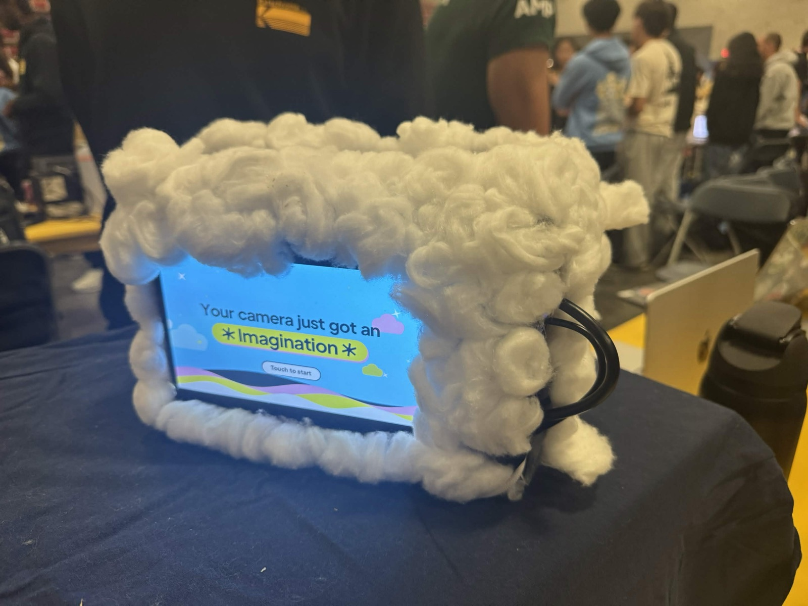

# Nimbus

An experimental camera built at HackMIT 2026. Nimbus keeps the photographed
subject unchanged while using light, temperature, motion, sound, and weather
data to generate a new setting around them.

**[Watch the demo](https://youtu.be/b3_kws8iIpU)** ·
**[Instagram](https://www.instagram.com/nimbus_hackmit2026/)** ·
**[Web interface](web/)**

The prototype runs across a Raspberry Pi 4, an Arduino UNO Q, and an ASUS
Ascent GX10. It supports voice capture, searchable photo metadata, QR sharing,
printing, and pixel-level verification that the protected subject was preserved.

The app has two modes:

- **AI Camera:** takes a photo, chooses a design based on what's in it, and sends it
  to a GPU server to generate the result. The pipeline uses a subject mask to keep
  the selected subject from the original photo while changing the area around it.
- **Visa Buy:** takes an unedited photo, identifies the item or dish, and searches
  for shopping options. The app includes a Visa checkout flow; purchase completion
  is not covered by our current hardware tests.

You can browse saved photos, search them by voice or text, and open a photo link
on your phone by scanning a QR code. Voice, sharing and Instagram posting require
their respective services and credentials. Automatic Instagram posting is enabled
by default; set `NIMBUS_AUTO_POST=0` for testing.

The Raspberry Pi runs the screen and webcam. An Arduino UNO Q supplies thermal
readings and button input, and an ASUS GPU computer processes AI captures over
the network. Sensor readings are included with captures; the current AI Camera
mode chooses its design from the photo's content.

## Repository guide

| Where | What |
|---|---|
| [docs/DESIGN.md](docs/DESIGN.md) | Original design notes, including earlier mode names and sensor-effect concepts |
| [TEAM_HARDWARE_RUNBOOK.md](TEAM_HARDWARE_RUNBOOK.md) | **Hardware handoff**: touchscreen wiring, camera bring-up, board roles, ASUS/Pi networking, verified behavior, and open gaps |
| [device/](device/) | The camera app (voice, screen, d-pad, tagging, search). Runs on the Raspberry Pi rig; Mac development and legacy UNO Q mode are also supported |
| [pipeline/](pipeline/) | The image pipeline and API (`nimbus`), deployed on the GPU box |
| [infra/elastic/](infra/elastic/) | Elasticsearch for photo search |
| [docs/HANDOFF.md](docs/HANDOFF.md) | Deployment handoff notes; check dates before relying on host or service status |
| [docs/TRACKS.md](docs/TRACKS.md) | Sponsor tracks: what to show a judge for each, and the demo order |
| [docs/demo/](docs/demo/) | Demo renders |

Quick start on a Mac: see [device/README.md](device/README.md) (`uv run python -m nimbus_cam --mac`).

Never commit credentials, Tailscale authentication links, Wi-Fi passwords,
camera tokens, or private user photos.

## Current rig and performance

The Raspberry Pi 4 runs the touchscreen app and USB C270 webcam. The Arduino UNO Q
provides thermal readings and buttons; the ASUS GPU computer runs the AI service.
See [device setup](device/README.md) and [network recovery](device/NETWORK_RECOVERY.md).

The tested Pi launcher selects the SDL2 presenter at a 24 FPS target. Steady home-screen
callback throughput measured approximately 23.9–24.0 FPS; capture/review transitions
still have occasional hitches. This is app callback throughput, not measured display
scanout or camera-to-screen latency. A fresh checkout defaults to Tk at 15 FPS until
configured. See [measurements and limitations](device/FRAME_PACING_RESULTS.md).

An intermittent capture error (`Server disconnected without sending a response`)
remains under investigation. Experimental camera buffering changes are not on main
and have no verified hardware speedup yet.
