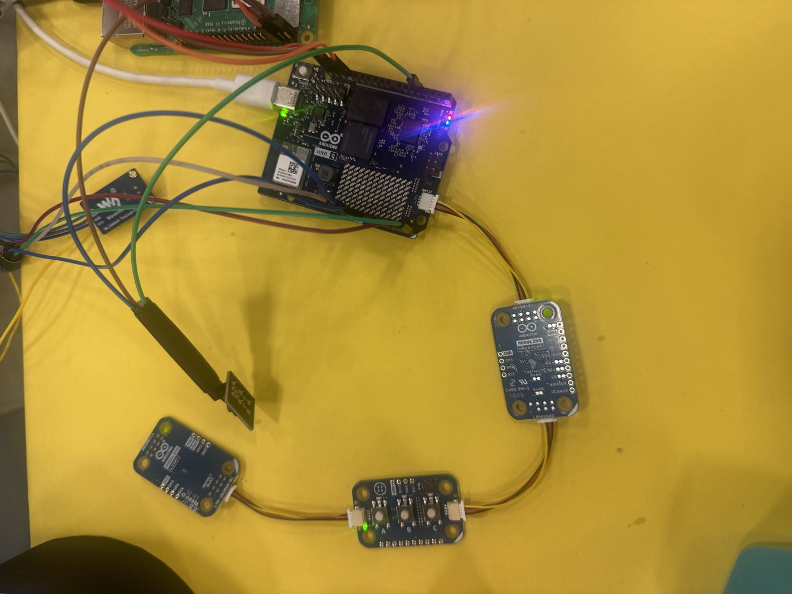
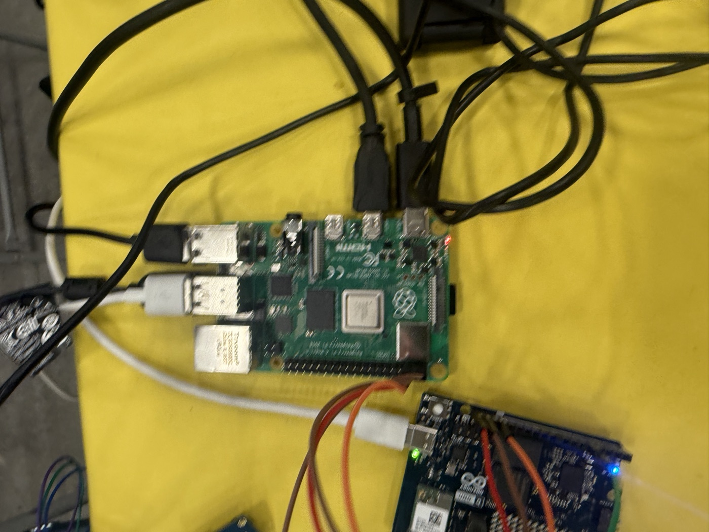
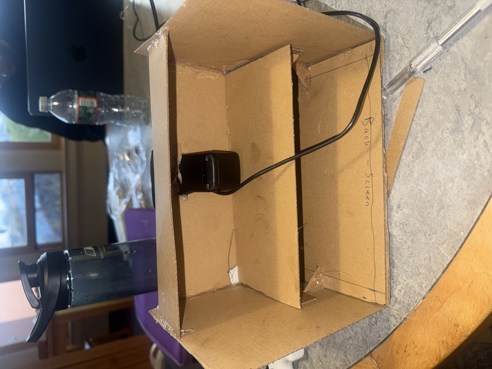
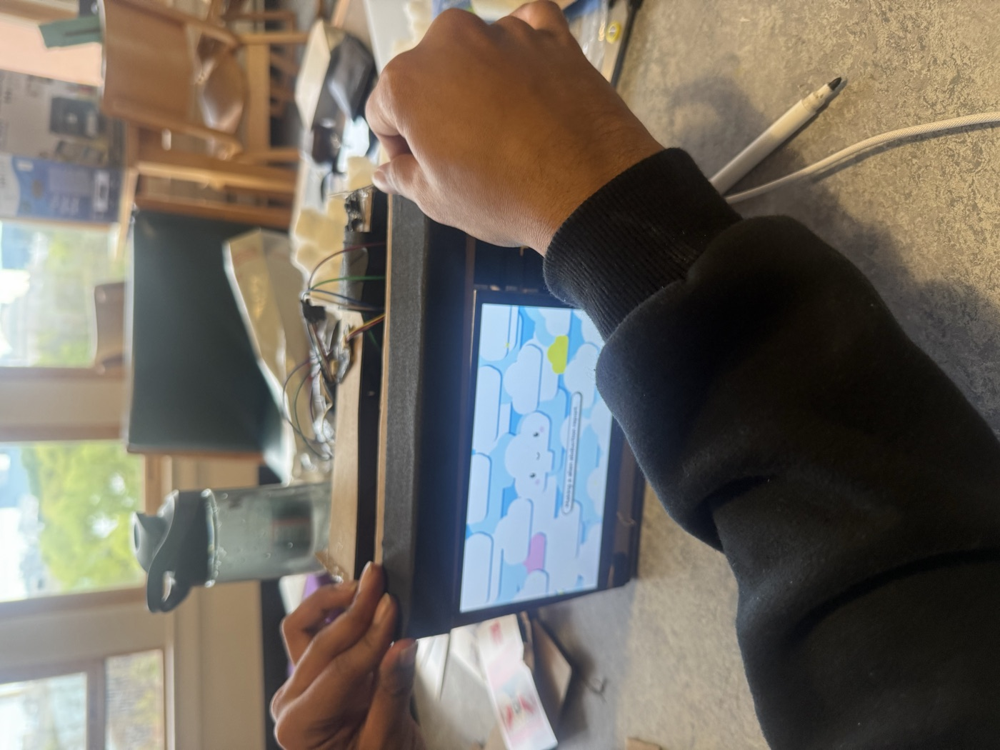
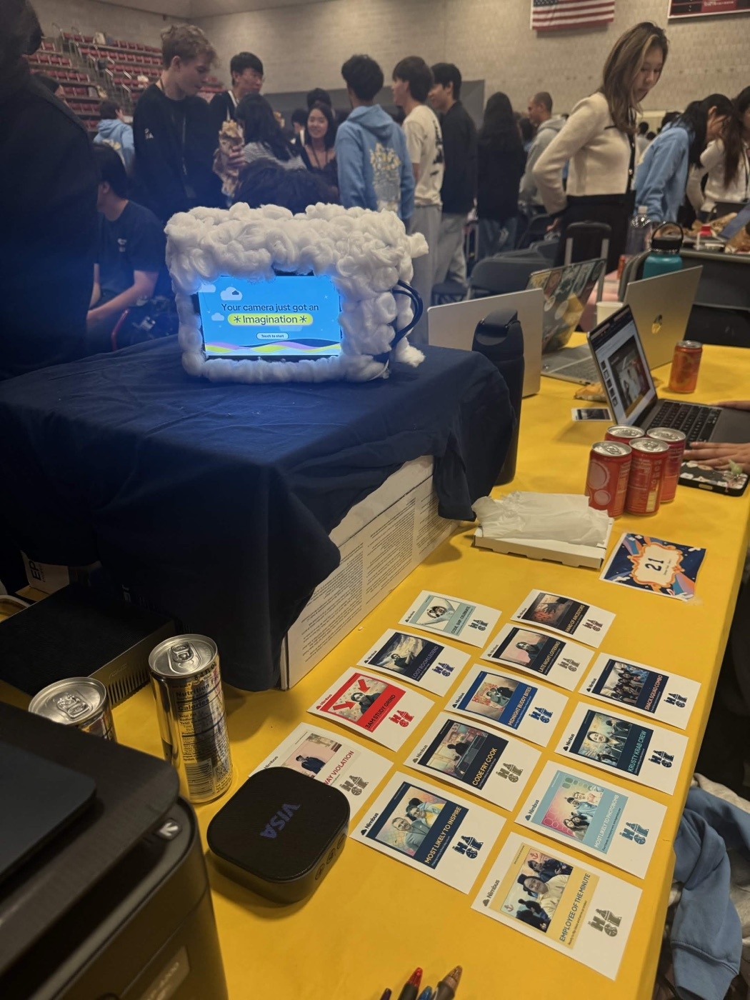
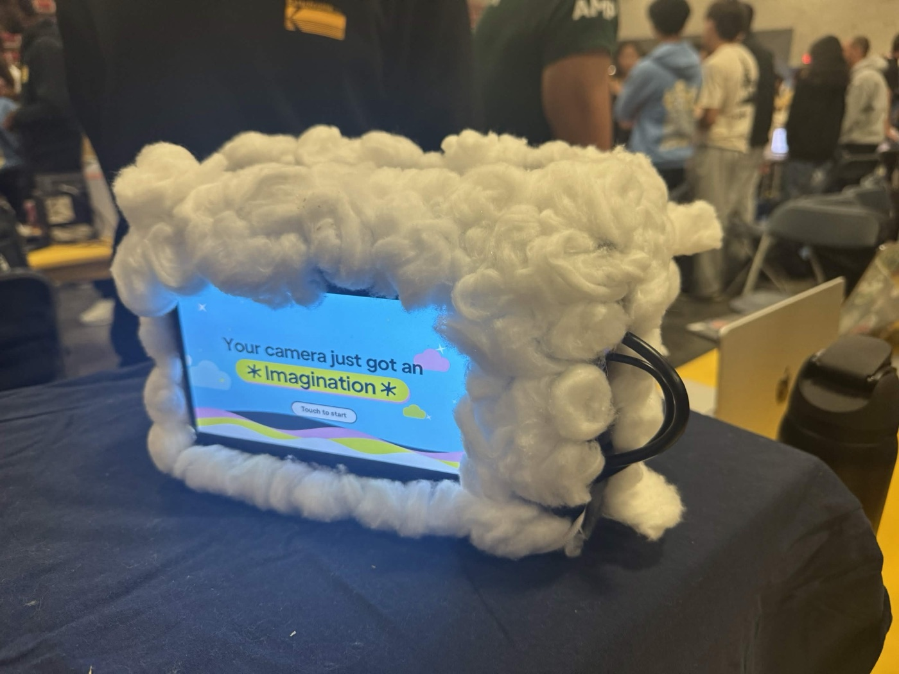
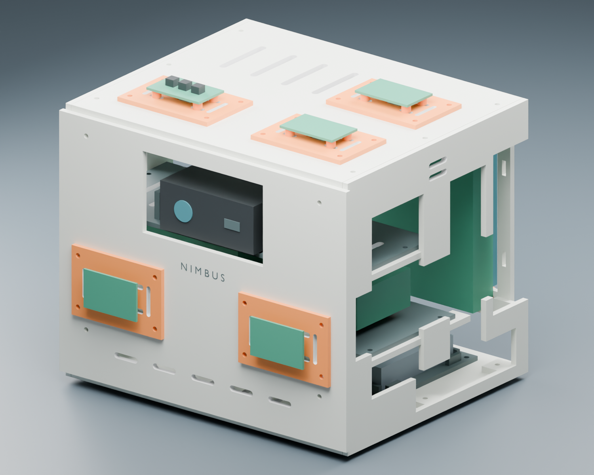
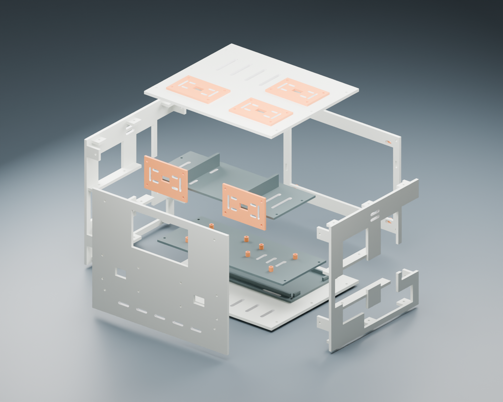

# Building Nimbus

Nimbus started as loose electronics on a table and ended the weekend as a
working camera people could use at HackMIT. This page documents the physical
build; the software architecture and measured performance are covered in the
[design notes](DESIGN.md).

## 1. Sensor electronics on the bench

We began by testing the sensor and control boards individually, before there
was an enclosure. Keeping everything accessible made it possible to verify
power, cabling, and readings independently. This also exposed the practical
side of the build early: several failures that looked like software problems
were actually power, USB, or wiring problems.

## 2. Raspberry Pi and Arduino integration

The Raspberry Pi 4 became the main device computer, responsible for the camera,
touchscreen, and application interface. The Arduino UNO Q supplied thermal
readings and physical-control input. The Pi forwarded captures and metadata to
the separate ASUS GPU computer for generation, so the device could remain a
portable front end instead of carrying the full model locally.

## 3. Building the first enclosure

The event enclosure was built from cardboard and hot glue because it could be
cut and changed immediately as the hardware layout evolved. An internal shelf
separated the screen from the boards, the webcam was mounted at the front, and
the sides remained accessible for cooling, power, and last-minute wiring. The
goal was not a polished shell yet; it was a rigid prototype that could survive
continuous handling at the booth.

## 4. Touchscreen interface on the assembled rig

With the screen, webcam, Pi, controls, and sensor wiring in one body, we could
test the complete interaction on the actual device. The touchscreen provided
the live viewfinder, touch-to-start screen, capture and review flow, gallery,
and shopping controls. Testing on the rig also revealed UI stalls that were not
obvious on a development laptop, leading to the background camera reader,
cached artwork, asynchronous review preparation, and SDL2 presenter described
in the [performance notes](../device/FRAME_PACING_RESULTS.md).

## 5. Working HackMIT prototype

By the demo, Nimbus could capture a person, send the image to the GPU pipeline,
show the generated result on its touchscreen, retain searchable metadata, and
share or print the output. The cotton cloud covering was added around the
cardboard structure after the electronics and interface were working. It gave
the prototype its final character without hiding that it was a weekend build.

## 6. From event prototype to printable enclosure

The cardboard build established the real component arrangement and cable
constraints. After the event, those measurements were carried into a modular,
3D-printable enclosure with a removable roof, replaceable front, electronics
shelf, service access, and dedicated mounts for the Raspberry Pi, UNO Q,
screen, webcam, and battery.

| Assembled concept | Internal layout |
|---|---|
|  |  |

The printable design and its limitations are documented in
[the enclosure README](../design/modular-camera/README.md). The CAD is a design
iteration based on the working prototype; it should not be presented as a
fully printed and hardware-validated replacement until that physical build has
been completed.

## What the physical build taught us

- Validate camera, display, touch, sensors, and power independently before
  debugging the full stack.
- A distributed prototype needs explicit recovery paths for both USB devices
  and the Pi-to-GPU network connection.
- UI performance must be measured on the target hardware, not inferred from a
  laptop run.
- A fast, editable enclosure is valuable during integration. Precise CAD makes
  more sense after the real cable and component constraints are known.

